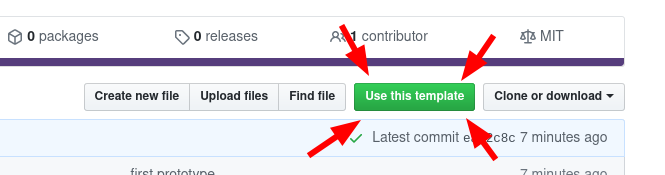
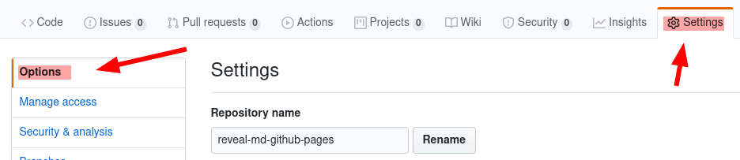
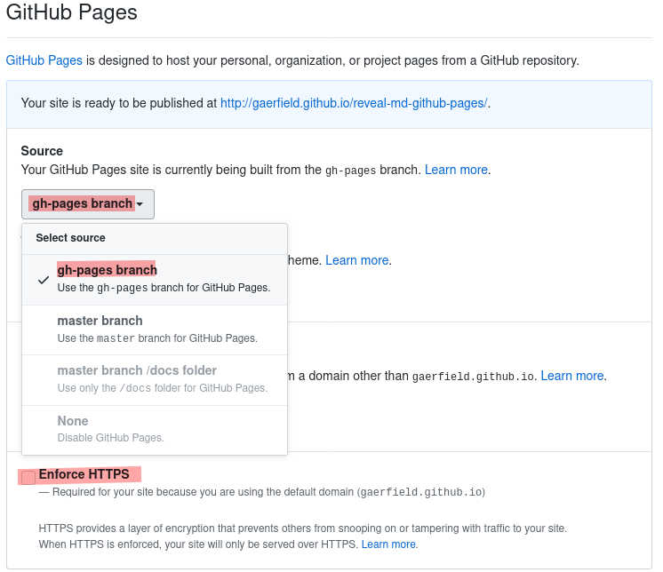

<!--s-->

<!--s-->

#using chatgpt for commitgpt
Ref:https://github.com/RomanHotsiy/commitgpt

<!--s-->
## get started

* just press this nice & friendly green button

<!--s-->
## get started

* give your new repo a name
* keep it public! (or git will deny to publish it)

<!--s-->
## get started

* choose 'gh-pages' to be the public-branch

<!--s-->
## get started

* choose 'gh-pages' to be the public-branch by:
  * first switching to master
  * and then switching back to gh-pages
  * github-bug? ¯\\_(ツ)_/¯

<!--s-->

